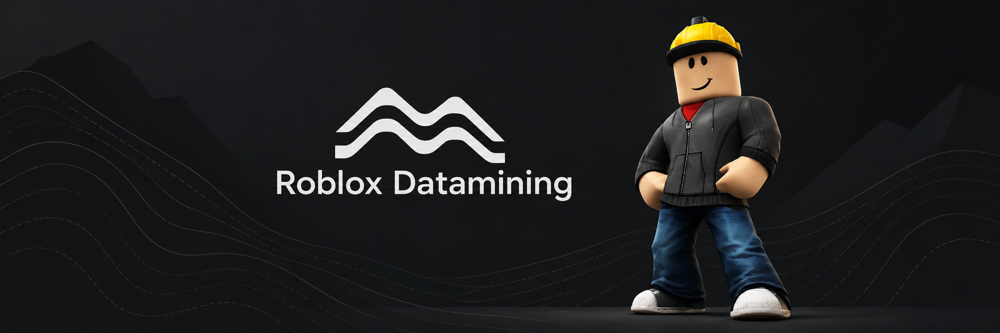

# Roblox Studio Datamining, API and Build Tracker

An automated Roblox Studio client tracker and datamining archive maintained by Moraine. Follow Roblox Studio builds and GUIDs, API dumps and API changes, plugins, LuaPackages, FastFlags and FastVariables, LIVE settings, native metadata, extracted resources, web assets, and chronological diffs observed from public Roblox distribution endpoints.

This repository contains independently observed Windows Studio data. The extraction and publication infrastructure is maintained separately from this data archive.

**Latest data:** [open the current datamining report](LATEST.md) or browse the [latest canonical state](current/).

## Archive layout

- [`2026/`](2026/) contains chronological event records under `YYYY/MM/DD/HH-MM-SSZ_event/`.
- [`current/`](current/) contains the latest canonical state for every observed surface.
- [`LATEST.md`](LATEST.md) points to the most recent observed event.
- [`events.jsonl`](events.jsonl) is the append-only machine-readable event index.
- [`docs/`](docs/) documents provenance, event semantics, and interpretation rules.
- Git history preserves earlier canonical contents and source-level changes.

## Observed surfaces

Studio observations include build and API metadata, plugins, Lua packages, native static metadata, FastVariables, LIVE settings, web assets, and provenance records. The `Resources` surface extracts official resource packages into navigable files under [`current/Resources/files/`](current/Resources/files/) and tracks shaders, Studio SVG textures, avatar resources, configurations, dictionaries, translations, and Studio XML metadata. Per-package inventories record each original path, size, and SHA-256 hash.

Readable official Lua and Luau source is retained with upstream formatting, names, identifiers, and developer comments. Compiled source fields remain identified separately and are not presented as original readable source.

## Interpretation

The summary convention is `+` added, `~` changed, and `-` removed. The presence of an identifier, flag, endpoint, source module, configuration value, or other artifact does not confirm that a feature is enabled, publicly available, or planned for release.

Read [the methodology](docs/METHODOLOGY.md) for provenance and event details, and [SECURITY.md](SECURITY.md) before reporting sensitive material.

## Disclaimer and rights

This is an independent research and archival project. It is not affiliated with, endorsed by, sponsored by, or associated with Roblox Corporation.

Roblox, the Roblox logo, and all related names, trademarks, software, assets, and content are the property of Roblox Corporation or their respective rights holders. This repository documents technical observations for research, interoperability, preservation, and educational purposes. Moraine does not claim ownership of Roblox intellectual property.

No license is granted for third-party material contained or referenced in this archive. See [NOTICE.md](NOTICE.md) for the complete rights notice and removal-request information.

## Commit comments

The Commit comments workflow is triggered by observed datamining commits and posts a compact summary directly on the corresponding commit. It does not perform datamining, generate events, modify datasets, or run for no-op checks; every displayed value comes from the event that was already committed.
